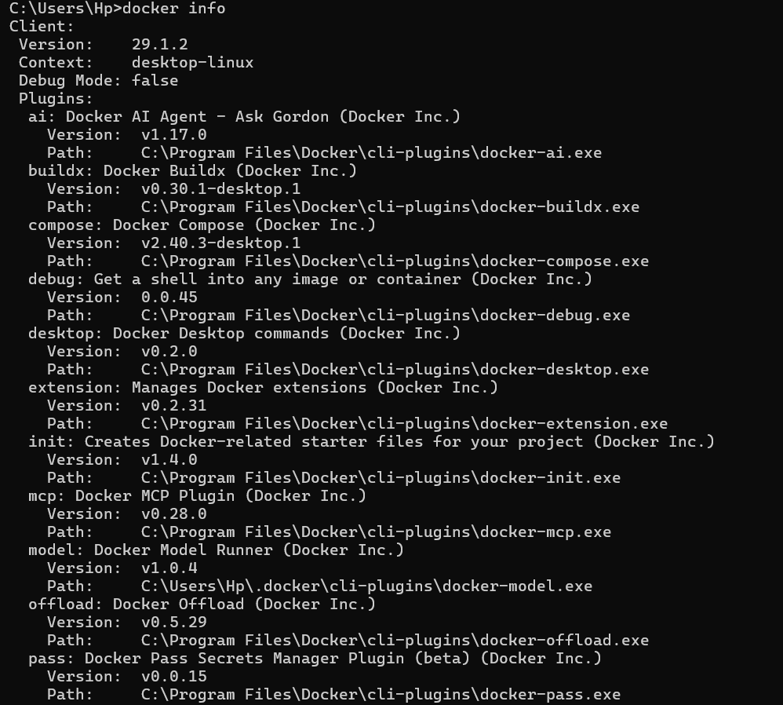
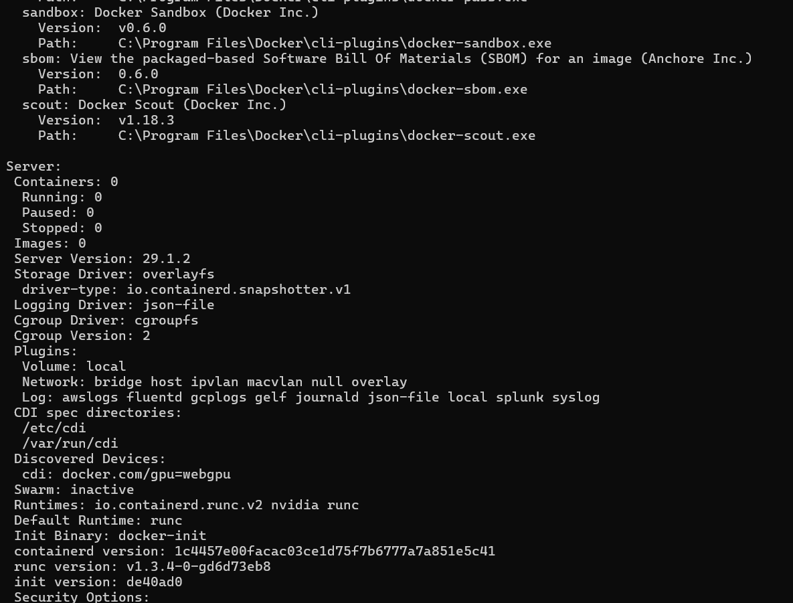
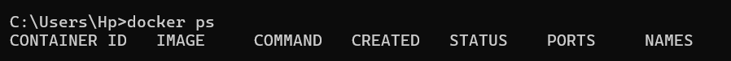
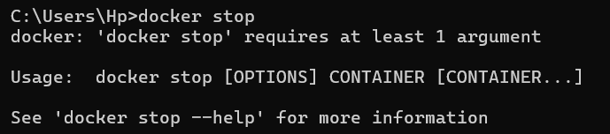
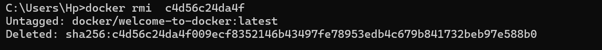

<!-- Commande docker details -->

<!--Commande docker info -->

<!-- Commande docker ps -->

<!-- Commande docker images -->

<!-- Commande docker run -->

<!-- Commande docker stop -->

<!-- Commande docker pull -->

<!-- Commande docker images -->

<!-- Commande docker stop -->

<!-- Commande docker rmi images -->

<!-- COmmande supprimer conteneur specifique -->

docker rm (-)

<!-- Commande supprimer Plusieurs conteneurs -->

docker rm (-) (-)

<!-- Supprimer Tous les conteneurs arrêtés -->

docker rm prune

<!-- Forcer la suppression d'un conteneur actif -->

docker rm -f (-)

<!-- Supprimer Une image spécifique -->

docker rmi (-)

<!-- Supprimer Plusieurs images -->

docker rmi (-) (-)

<!-- Supprimer Toutes les images inutilisées -->

docker image prune

<!-- Supprimer Toutes les images non utilisées -->

docker image prune -a

<!-- Forcer la suppression d'une image -->

docker rmi -f (-)
