<!-- Commande docker details -->

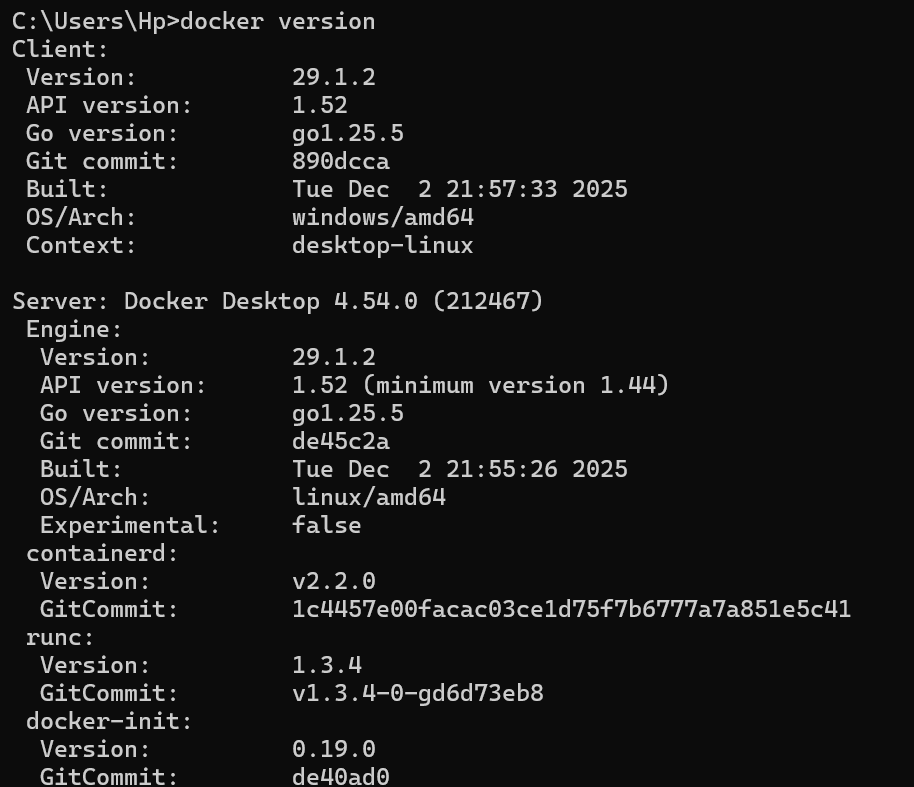

<!--Commande docker info -->

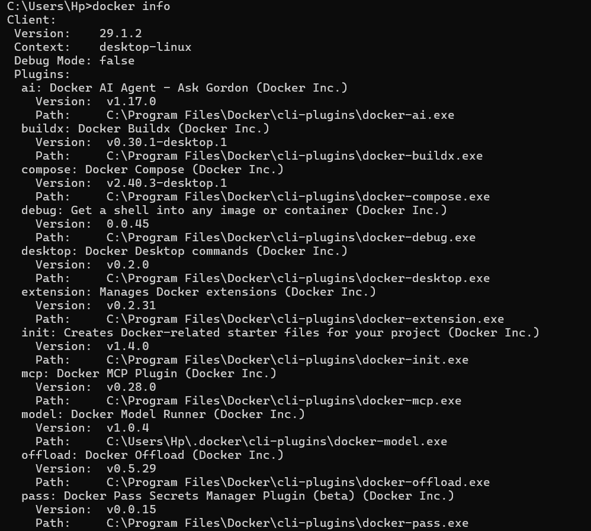
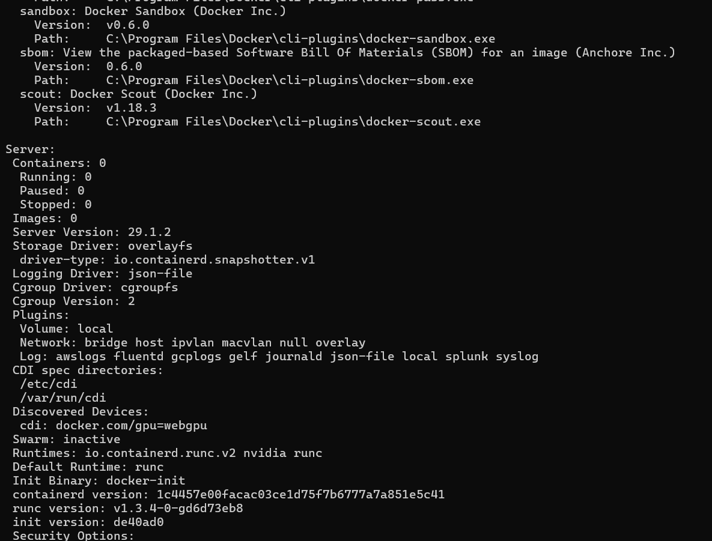
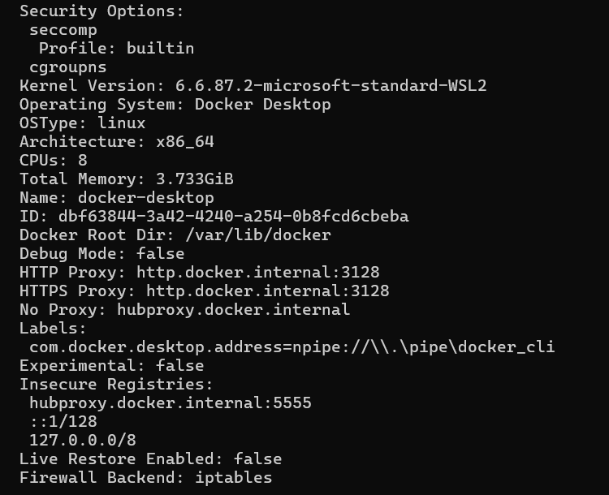

<!-- Commande docker ps -->

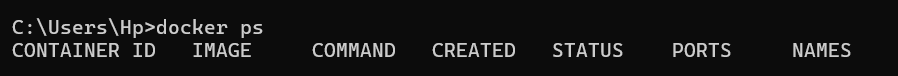

<!-- Commande docker images -->

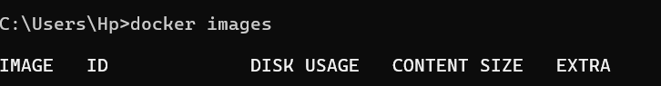

<!-- Commande docker run -->

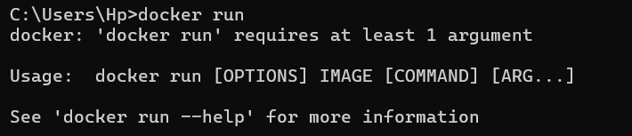

<!-- Commande docker stop -->

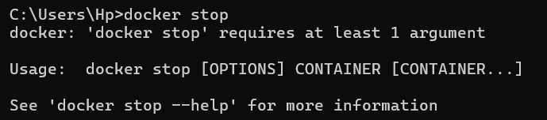

<!-- Commande docker pull -->

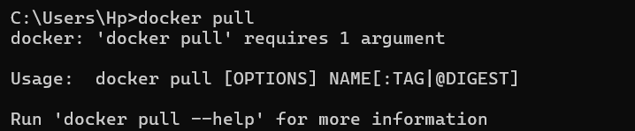

<!-- Commande docker images -->

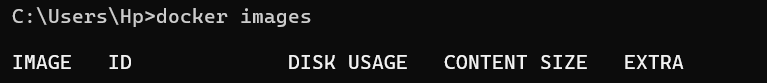

<!-- Commande docker stop -->

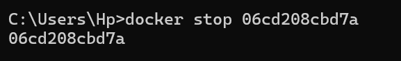

<!-- Commande docker rmi images -->

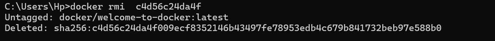

<!-- COmmande supprimer conteneur specifique -->

docker rm (-)

<!-- Commande supprimer Plusieurs conteneurs -->

docker rm (-) (-)

<!-- Supprimer Tous les conteneurs arrêtés -->

docker rm prune

<!-- Forcer la suppression d'un conteneur actif -->

docker rm -f (-)

<!-- Supprimer Une image spécifique -->

docker rmi (-)

<!-- Supprimer Plusieurs images -->

docker rmi (-) (-)

<!-- Supprimer Toutes les images inutilisées -->

docker image prune

<!-- Supprimer Toutes les images non utilisées -->

docker image prune -a

<!-- Forcer la suppression d'une image -->

docker rmi -f
