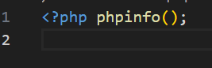
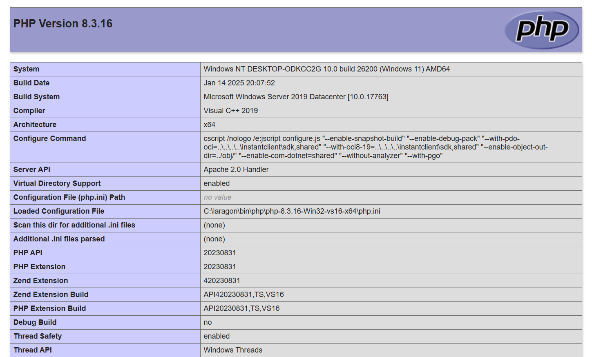
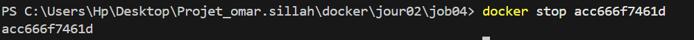

<!-- Command php pour les infos -->

<!-- Informations sur le serveur apache  -->

<!-- Construction de l'image Docker à partir du Dockerfile du dossier courant -->

<!--  Lancement du conteneur en mode détaché -->

<!-- Arret du conteneur -->

