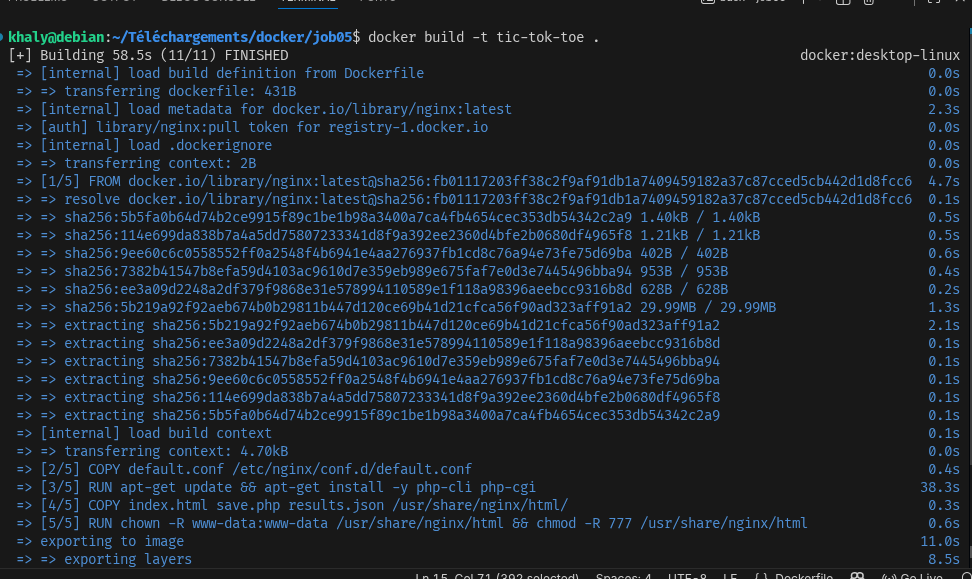
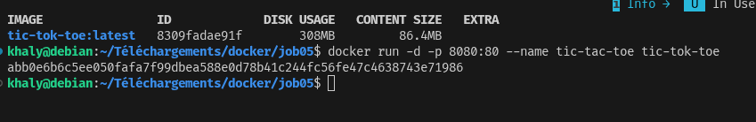
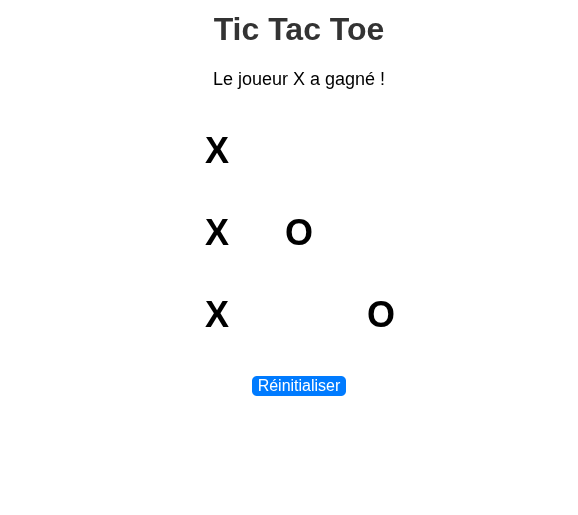
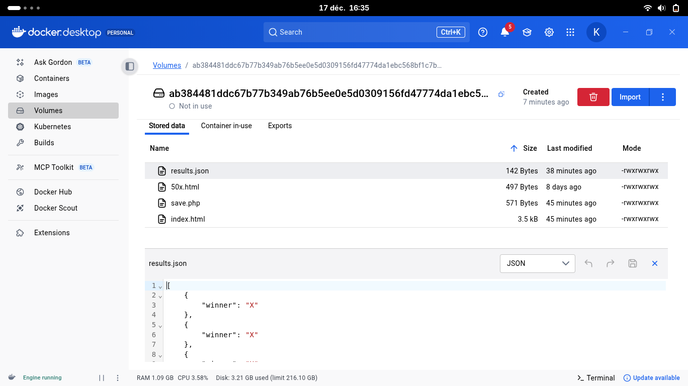

# PROJET TIC-TOC-TOE

## Creation des fichiers de base:
index.html
save.php
results.json

## Etapes pour realiser le projet:
default.conf: pour la configuration du lancement
Dockerfile: pour les instruction de buld de l'image
Faire un build de l'image `docker build -t image`

faire un Run avec volume `docker compose up -d --build`

## RENDU:

## VOLUME:
Le volume nommé `tic-tac-toe-data` garde `results.json` même après suppression du conteneur.
