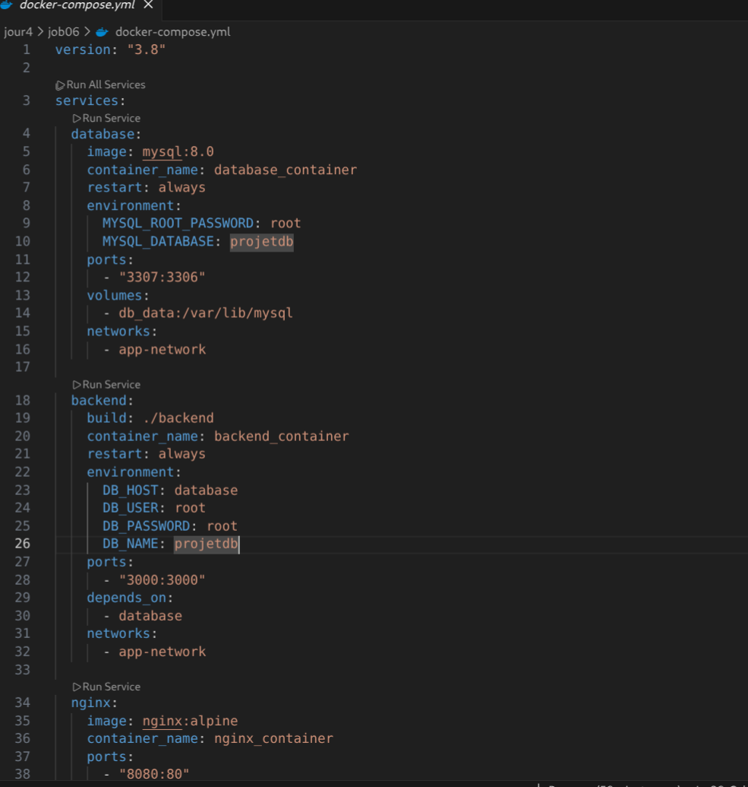
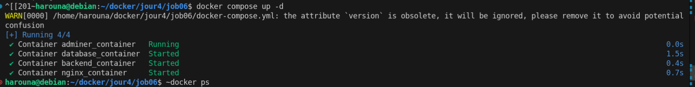
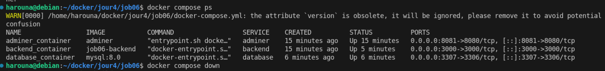
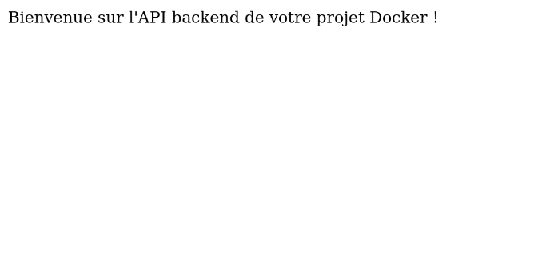
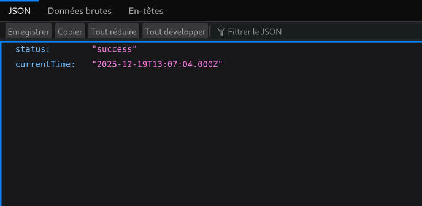
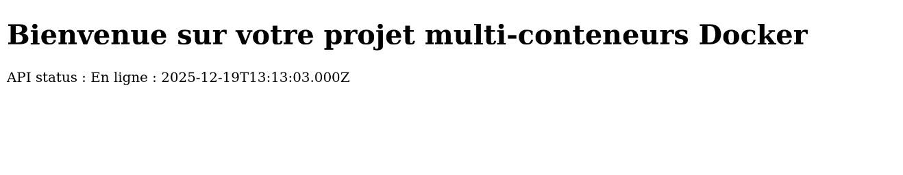

# Jour 4 – Job 06 – Application multi-conteneurs Docker

## Création du fichier docker-compose.yml

Résultat :  

---

## Construction des images Docker

Résultat :  

---

## Lancement des conteneurs Docker

Résultat :  

---

## Vérification des conteneurs en cours d’exécution

Résultat :  

---

## Accès à Adminer (gestion de la base de données)

Adresse:
http://localhost:8081/

Paramètres de connexion :

Serveur : database
Utilisateur : root
Mot de passe : root
Base de données : projetdb

Résultat :  

---

## Test du backend Node.js

Adresse:
http://localhost:3000/

Résultat :  

---

## Test de l’API (connexion Backend ↔ MySQL)

Adresse:
http://localhost:3000/api/status

Résultat :  

---

## Accès au frontend via Nginx

Adresse:
http://localhost:8080/

Résultat :  

---

## Fin du Job 06

Application multi-conteneurs fonctionnelle avec communication réseau entre services, persistance des données et interface d’administration graphique.